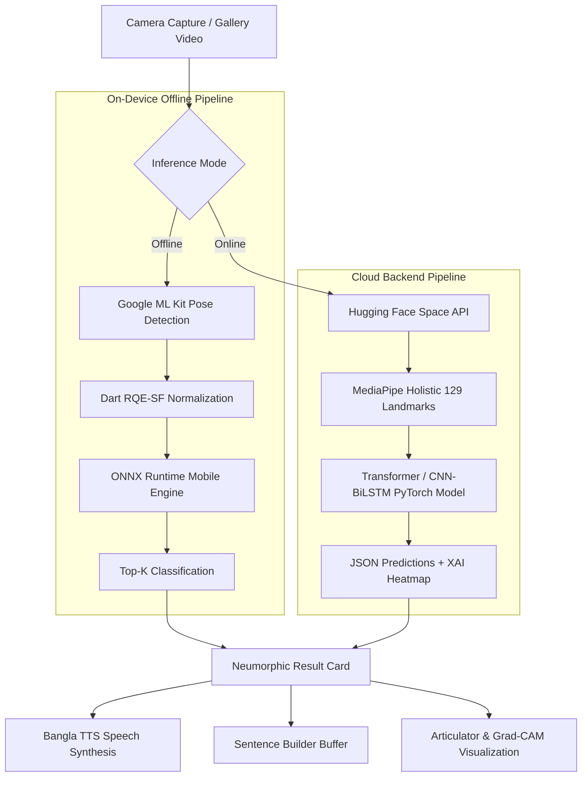

# 🤟 BdSL – Intelligent Bangladeshi Sign Language Recognition App

<div align="center">

[](https://flutter.dev/)
[](https://dart.dev/)
[](https://onnxruntime.ai/)
[](https://huggingface.co/spaces/saifur2025/BdSLW)
[](https://opensource.org/licenses/MIT)
[](https://flutter.dev)

**A state-of-the-art, cross-platform mobile application for real-time Bangladeshi Sign Language (BdSL) word recognition.**  
Powered by the **[BdSLW401](https://github.com/saifur-rahman0/BdSLW401)** 401-word vocabulary benchmark with on-device ONNX inference, cloud-accelerated MediaPipe Holistic models, tactile Neumorphic UI, and Bangla Text-to-Speech.

---

[Key Features](#-key-features) • [Architecture](#-system-architecture) • [App Showcase](#-app-showcase) • [Installation](#-getting-started) • [Model Zoo](#-supported-models) • [Citation](#-citation)

---

</div>

---

## 📖 Overview

Communication barriers between the deaf/hard-of-hearing community and the wider society remain a major social challenge in Bangladesh. **BdSL** is designed to bridge this gap by translating complex, continuous 3D hand, body, and facial gestures into clear Bengali words and audible speech.

The application is built directly upon the research and models developed in **[BdSLW401](https://github.com/saifur-rahman0/BdSLW401)**, an extensive 401-word dataset and deep learning benchmark.

### 🌟 Highlights
- **401 Bengali Sign Vocabulary:** Full coverage of standard Bengali words including verbs, nouns, emergency terms, daily communication, and numerals.
- **Hybrid AI Engine:** Seamless switching between **Offline On-Device Inference** (zero internet latency) and **Cloud API** (maximum precision via 129-landmark MediaPipe Holistic).
- **Bangla Text-to-Speech (TTS):** Instant audio playback of recognized words in authentic Bengali accent.
- **Sentence Builder:** Accumulate, reorder, and vocalize multi-word sign sentences with smart punctuation.
- **Explainable AI (XAI):** Real-time spatial/temporal landmark heatmaps and anatomical contribution breakdowns (Face, Hands, Body Pose).

---

## ✨ Key Features

### 1. ⚡ Hybrid Dual-Mode AI Engine
| Mode | Engine | Preprocessing | Latency | Network |
| :--- | :--- | :--- | :--- | :--- |
| **Offline Mode** | On-Device ONNX Runtime (`assets/models/*.onnx`) | `google_mlkit_pose_detection` + Pure Dart RQE-SF | ~35ms | ❌ None (100% Offline) |
| **Cloud Mode** | Hugging Face Spaces FastREST API | Full MediaPipe Holistic (54 Face + 42 Hand + 33 Pose) | ~300ms | 🌐 Requires Internet |

### 2. 🎨 Tactile Neumorphic Design & Bilingual UI
- **Neumorphism Aesthetic:** Soft, tactile surfaces with gentle shadows, smooth micro-interactions, and high contrast visibility.
- **Bilingual Localization:** Instant toggling between **English** and **বাংলা (Bengali)** across all UI elements, labels, buttons, and system dialogs.

### 3. 🗣️ Bangla Voice Synthesis & Sentence Builder
- Read aloud recognized signs in clear Bangla using `flutter_tts`.
- Construct fluent sign sentences by buffering recognized tokens in the **Sentence Builder** workspace with one-tap clearing, re-ordering, and batch vocalization.

### 4. 🧠 Explainable AI (XAI) & Articulator Breakdown
- **Articulator Importance:** Displays percentage contribution of Left Hand, Right Hand, Body Pose, and Facial Cues for every prediction.
- **Grad-CAM Saliency Overlay:** Heatmap visualizations highlighting which video frames and joints triggered the classification.

### 5. ⏱️ Smart Guided Recording Studio
- **3-Step Visual Rhythm Guide:**  
  1. *Ready (0.5s)*: Hands resting at chest/waist level.  
  2. *Sign (1.0 - 1.5s)*: Perform gesture fluidly.  
  3. *Finish (0.5s)*: Return hands to resting state.
- **Auto-Stop 3s Timer:** Automatically caps video capture at 3.0 seconds to prevent bloated uploads and optimize inference speed.
- **Retake Safety Token:** Cancels stale background HTTP requests immediately when the user retakes a video.

### 6. 📜 History & Favorites Library
- Persistent storage of past recognitions with timestamp, top-1 confidence score, and model architecture metadata using `shared_preferences`.
- Bookmark frequent signs for quick offline reference.

---

## 🏗️ System Architecture



---

## 📂 Project Structure

```
Sign-Language-App/
├── android/                   # Android native configuration, permissions, and icons
├── assets/
│   ├── data/
│   │   └── label.json         # 401 Bengali sign word mapping (Index -> Bangla -> English)
│   ├── images/
│   │   └── BdSL_logo.png      # High-resolution application branding logo
│   └── models/                # Quantized ONNX models for offline mobile inference
│       ├── cnn_frontview.onnx
│       ├── cnn_interpolated_frontview.onnx
│       ├── cnn_interpolated_multiview.onnx
│       ├── cnn_multiview.onnx
│       ├── transformer_frontview.onnx
│       ├── transformer_interpolated_frontview.onnx
│       ├── transformer_interpolated_multiview.onnx
│       └── transformer_multiview.onnx
├── ios/                       # iOS native configuration and camera permissions
├── lib/
│   ├── l10n/
│   │   └── app_strings.dart   # Bilingual localization dictionary (Bangla / English)
│   ├── screens/
│   │   └── splash_screen.dart # Animated Neumorphic splash screen & warm-up
│   ├── services/
│   │   ├── offline_inference_service.dart   # On-device ONNX runtime execution
│   │   ├── on_device_landmark_service.dart  # Google ML Kit joint extraction
│   │   └── rqe_service.dart                 # Pure Dart RQE-SF feature normalization
│   ├── theme/
│   │   └── neu_theme.dart     # Neumorphic color palette, shadows, and decorations
│   ├── widgets/
│   │   ├── app_drawer.dart            # Navigation drawer, settings, and model selector
│   │   ├── articulator_breakdown.dart # XAI anatomical contribution bar charts
│   │   ├── heatmap_legend.dart        # Grad-CAM color scale indicator
│   │   ├── history_panel.dart         # Recognition history and saved favorites
│   │   ├── model_info_card.dart       # Active model stats and telemetry
│   │   ├── neu_button.dart            # Custom interactive Neumorphic buttons
│   │   ├── neu_card.dart              # Custom embossed/debossed containers
│   │   ├── result_card.dart           # Top-K predictions, confidence meters, TTS
│   │   └── sentence_builder.dart      # Interactive multi-word sentence builder
│   ├── landmark_painter.dart  # Custom canvas skeleton overlay painter
│   ├── main.dart              # Application entry point
│   └── sign_language_app.dart # Core interactive studio and video playback
├── pubspec.yaml               # Project dependencies and asset declarations
└── README.md                  # Project documentation
```

---

## 🚀 Getting Started

### Prerequisites
- **Flutter SDK:** `>= 3.10.3` ([Install Flutter](https://docs.flutter.dev/get-started/install))
- **Dart SDK:** `>= 3.0.0`
- **Android Studio** / **VS Code** with Flutter extensions
- **Physical Device or Emulator** (Physical device recommended for camera & ML Kit performance)

### 1. Clone the Repository
```bash
git clone https://github.com/saifur-rahman0/Sign-Language-App.git
cd Sign-Language-App
```

### 2. Install Dependencies
```bash
flutter pub get
```

### 3. Setup Android Permissions
Ensure `android/app/src/main/AndroidManifest.xml` contains the required camera and storage permissions (already pre-configured):
```xml
<uses-permission android:name="android.permission.CAMERA" />
<uses-permission android:name="android.permission.INTERNET" />
<uses-permission android:name="android.permission.READ_EXTERNAL_STORAGE" />
<uses-permission android:name="android.permission.WRITE_EXTERNAL_STORAGE" />
```

### 4. Run the Application
Connect your Android/iOS device or launch an emulator:
```bash
# Debug Mode
flutter run

# Release Mode (Optimal inference speed)
flutter run --release
```

---

## 📦 Building Release APK

To generate a standalone, optimized release APK for Android:

```bash
flutter build apk --release --split-per-abi
```

The compiled APKs will be located in:
`build/app/outputs/flutter-apk/app-arm64-v8a-release.apk`

---

## 🧠 Supported Models

The application supports 8 pre-trained model variants trained on the **BdSLW401** benchmark:

| Model Architecture | Input View | Interpolation | Top-1 Accuracy | Size |
| :--- | :--- | :--- | :--- | :--- |
| **Transformer (Multiview)** *(Recommended)* | Front + 45° + 90° | Linear 3D (30 fps) | **99.64%** | 10.4 MB |
| **Transformer (Frontview)** | Frontal View Only | Linear 3D (30 fps) | 98.85% | 10.4 MB |
| **CNN-BiLSTM (Multiview)** | Front + 45° + 90° | Linear 3D (30 fps) | 99.38% | 3.9 MB |
| **CNN-BiLSTM (Frontview)** | Frontal View Only | Linear 3D (30 fps) | 98.12% | 3.9 MB |

*All models are available in both ONNX format for on-device inference and PyTorch checkpoints on Hugging Face.*

---

## 🔗 Related Projects & Benchmark

- **Dataset & ML Benchmark Repository:** [https://github.com/saifur-rahman0/BdSLW401](https://github.com/saifur-rahman0/BdSLW401)
- **Hugging Face Space API:** [https://huggingface.co/spaces/saifur2025/BdSLW](https://huggingface.co/spaces/saifur2025/BdSLW)

---

## 📜 Citation

If you use this application, the dataset, or the trained models in your research, please cite the BdSLW401 benchmark:

```bibtex
@article{bdslw401_2025,
  title={BdSLW401: A Large-Scale Multiview Dataset and Deep Learning Benchmark for Word-Level Bangladeshi Sign Language Recognition},
  author={Rahman, Saifur and Collaborators},
  journal={arXiv preprint},
  year={2025},
  url={https://github.com/saifur-rahman0/BdSLW401}
}
```

---

## 📄 License

This project is licensed under the **MIT License** – see the [LICENSE](LICENSE) file for details.

---

<div align="center">
Developed with ❤️ for the Deaf and Hard-of-Hearing Community of Bangladesh.
</div>
